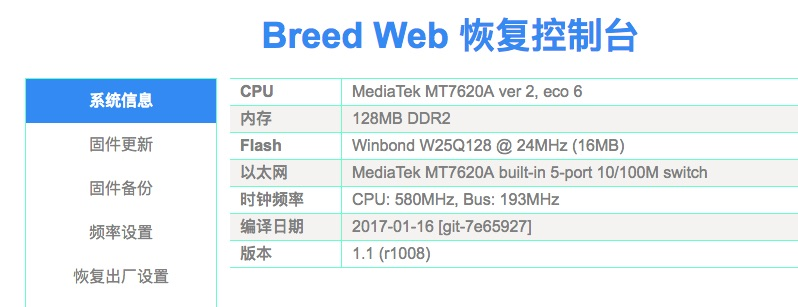
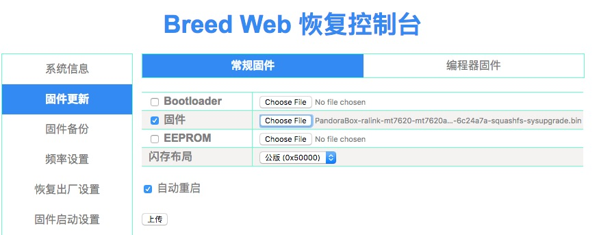
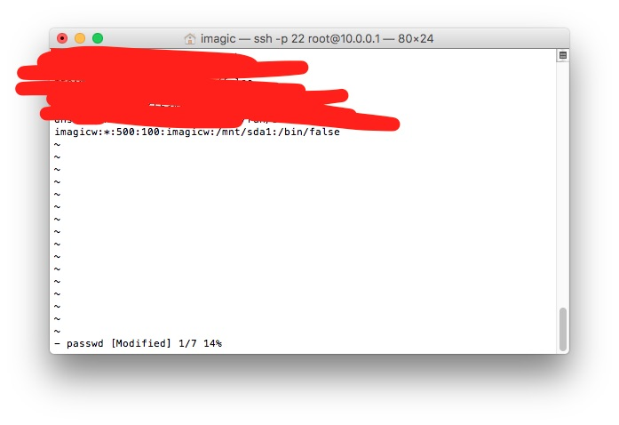
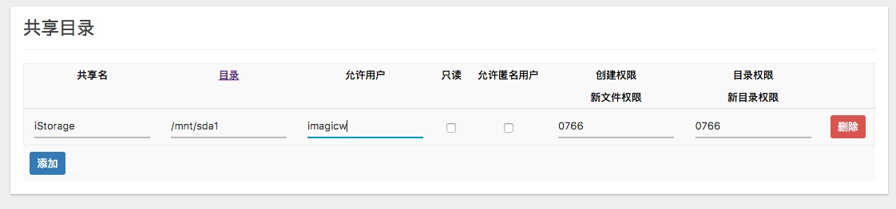
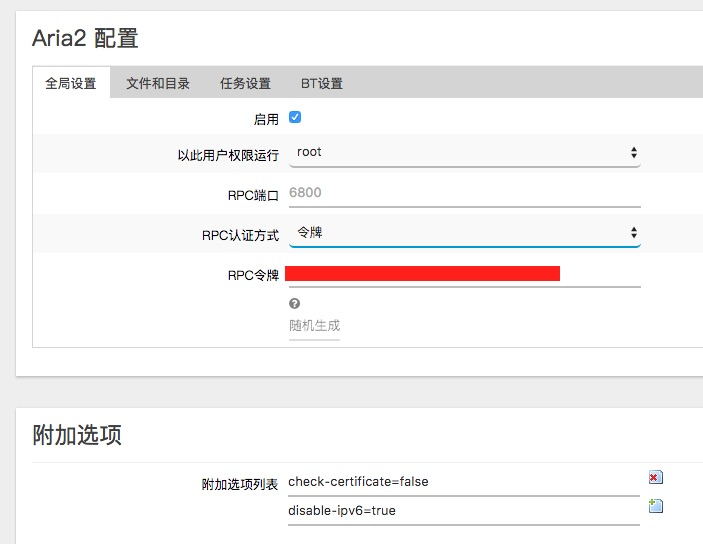
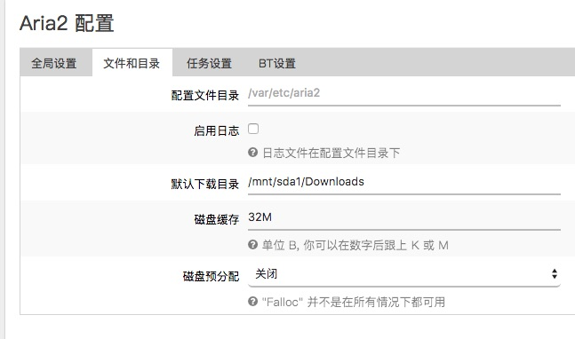
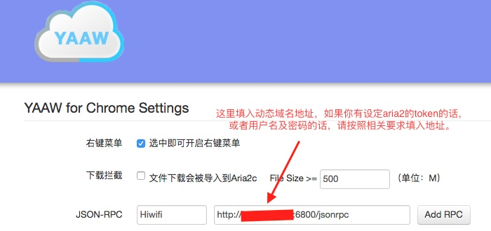
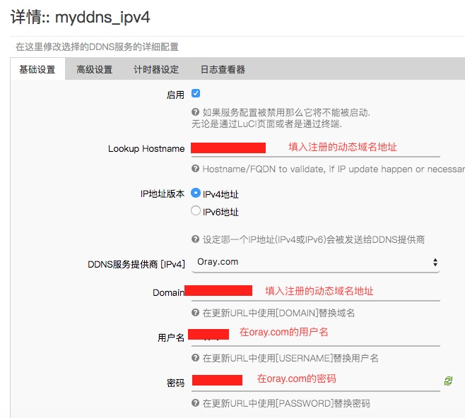
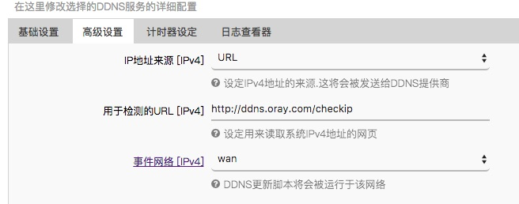

# 我是如何将路由器打造成我的下载中心的


## 前言

本来购买极路由是为了改善无线质量的，后来仅仅改变无线质量已经不能满足我，加上我之前的电脑CPU和显卡陆续烧坏，闲置了几块硬盘，于是就想折腾起路由器来让我闲置硬盘用起来。

本笔记主要是记录我如何折腾路由器的经历与心得。

## 准备
- 极路由3（已开通开发者权限）
- 网线一根
- 电脑一台
- 移动硬盘

**极路由3需要在路由器界面申请开发者权限，这样才能使用ssh。请注意，开启ssh后会失去官方保修服务！请谨慎。**

如何申请，请自行摸索或者百度谷歌Bing一下。

我使用的平台是MacOS 10.12，其他平台操作方法类似。

**刷机有风险，请小心开车。**
  <!--more-->

---

## 解锁u-boot

极路由的u-boot会验证固件版本，需要解锁才能安装第三方固件，同时为了避免刷固件失败造成变砖的情况，刷上不死u-boot可以有效避免悲剧发生。

首先需要在 [http://www.right.com.cn/forum/thread-161906-1-1.html](http://www.right.com.cn/forum/thread-161906-1-1.html) 找到对应的u-boot。

偷懒不看帖子的小伙伴可以直接在这里寻找 [http://breed.hackpascal.net/](http://breed.hackpascal.net/) ，极路由3是 `HC5861`，对应的u-boot就是 `breed-mt7620-hiwifi-hc5861.bin`，对应的下载地址就是 `http://breed.hackpascal.net/breed-mt7620-hiwifi-hc5861.bin`。

接下来就是要用ssh连接到路由器啦，我的路由器地址是 `10.0.0.1`，那我们打开终端（Terminal）开始使用命令吧。

*以下命令的中文仅是提示，请勿复制至命令行！请一个命令执行完再执行下一个命令。*

```
//连接路由器
ssh -p 22 root@10.0.0.1

//进入tmp目录
cd /tmp

//下载固件
wget http://breed.hackpascal.net/breed-mt7620-hiwifi-hc5861.bin

//安装u-boot
mtd -r write /tmp/breed-mt7620-hiwifi-hc5761.bin u-boot
```
此时，终端会显示 `Rebooting`，等待重启完毕后再切断路由器电源，按住路由器 `reset` 按钮后接通电源，等待路由器电源灯连续闪烁后松开 `reset`。

电脑会自动获取ip地址，我们通过浏览器访问 `192.168.1.1` 可以登录Breed Web恢复控制台，有了这个，我们就可以随意开车，不怕翻车啦！

 

---

## Openwrt

### 下载Openwrt

我使用的是 「[Pandorabox](http://downloads.pandorabox.org.cn/)」的 [PandoraBox-ralink-mt7620-mt7620a-evb-2017-01-03-git-6c24a7a-squashfs-sysupgrade.bin](http://downloads.pandorabox.com.cn/pandorabox-16-10-stable/targets/ralink/mt7620/PandoraBox-ralink-mt7620-mt7620a-evb-2017-01-03-git-6c24a7a-squashfs-sysupgrade.bin) 的固件，固件位于 `pandorabox-16-10-stable/targets/ralink/mt7620/` 目录下。

我没有选择 [PandoraBox-ralink-mt7620-hc5861-2017-01-03-git-6c24a7a-squashfs-sysupgrade.bin](http://downloads.pandorabox.com.cn/pandorabox-16-10-stable/targets/ralink/mt7620/PandoraBox-ralink-mt7620-hc5861-2017-01-03-git-6c24a7a-squashfs-sysupgrade.bin) 版本的原因是因为这个版本的USB挂载有问题，我也不知道如何解决。_（你们有解决方案烦请告诉我！万分感谢！）_

懒人可以点击上方固件名字下载。

### 安装Openwrt

下载完成后，进入Breed恢复控制台，选择「固件更新」，在右边「常规固件」下方勾选「固件」并上传刚刚下完的固件 `PandoraBox-ralink-mt7620-hc5861-2017-01-03-git-6c24a7a-squashfs-sysupgrade.bin`，同时勾选「自动重启」后点击「上传」按钮。

 

重启完成后，等待更新成功。浏览器访问 `192.168.1.1` 即可进入路由器登录界面，Pandorabox的初始密码是 `admin`，输入密码后即可进入。

### 基本设置

PandoraBox固件内置了两种主题，习惯于Openwrt的 `Bootstrap` 主题的可以 `系统 - 系统 - 语言与界面`下更改主题为 `Bootstrap`。

#### PPPOE拨号
在 `网络` 菜单下找到 `接口`并进入，找到接口 `WAN` 并编辑，协议改成 `PPPOE` 并`切换协议`，填入宽带帐号密码并`保存&应用`。

#### 无线设置
在 `网络` 菜单下找到 `无线` 并进入，有2.4G和5G两个无线接口，自行修改相应的无线即可。

我为了方便，将2.4G和5G的SSID和密码设置都是相同的。

---

### 挂载点

设置位于 `系统 - 挂载点`。

这个版本的固件会自动挂载USB连接的硬盘（U盘）设备，默认的挂载位置 `/mnt`，挂载名为 `sda1`，当然你挂载的硬盘比较多，之后的硬盘的挂载名会是 `sda2` `sda3`，以此类推。

### Samba共享

Samba共享是为了让网内的电脑能够方便地访问挂载的硬盘中的内容。当然，你也可以从路由器上拔下硬盘，连接到电脑上。

#### 设置

找到 `服务 - 网络共享`，全局设置根据个人喜好设置即可。

共享目录中将 `/mnt/sda1` 硬盘共享出去即可，如果你希望可以匿名访问，请勾选 `允许匿名访问` 选项，并可以跳过以下内容（包括**添加用户**）

编辑模板，为了安全，将模板做以下修改，主要是更改访客访问以及root访问的权限，禁止这2类用户访问。

```
[global]
	netbios name = |NAME| 
	display charset = |CHARSET|
	interfaces = |INTERFACES|
	server string = |DESCRIPTION|
	unix charset = |CHARSET|
	workgroup = |WORKGROUP|
	browseable = yes
	deadtime = 30
	domain master = |MASTER|
	encrypt passwords = true
	enable core files = no
#	guest account = nobody
#	guest ok = yes
	invalid users = root
	local master = yes
	load printers = no
	map to guest = Bad User
	max protocol = SMB2
	min receivefile size = 16384
	null passwords = yes
	obey pam restrictions = yes
	os level = 250 
	lm announce = yes
	lm interval = 10 
	dns proxy = no
	passdb backend = smbpasswd
	preferred master = yes
	printable = no
	security = user
	smb encrypt = disabled
	smb passwd file = /etc/samba/smbpasswd
	socket options = TCP_NODELAY IPTOS_LOWDELAY
	syslog = 2
	use sendfile = yes
	writeable = yes
```

#### 添加用户

那么，禁用了root和访客访问，我怎么通过网络共享连接到硬盘呢？

我们需要专门添加一个用户，设置相应访问权限，这样就不用担心因为root的权限高而引起的安全问题。

首先我们需要 `ssh` 到路由器上。

然后我们 `cd` 到 `/etc` 目录下，通过 `vi passwd` 命令来编辑用户表，按下 `i` 键即可编辑，在文本的最后一行加入以下内容后，保存即可。_（什么，你不知道怎么保存？那你只能请教百度谷歌Bing先生们了）_

 

好了，这样我们就新建了一个叫imagicw的用户了，并赋予其 `用户组` 的权限。

此时，我们还需要把这个用户添加至smbpasswd，输入以下命令

```
smbpasswd imagicw 123456
```

即可完成添加用户 `imagicw`，后面的数字就是密码。

此时我们还需要在共享目录允许用户里填上 `imagicw` 才算设置完成。

 

---

## Aria2

### 安装
在 `系统` 下的 `软件包` 中安装 `aria2`  `luci-app-aria2`及 `luci-i18n-aria2-zh-cn`。

当然喜欢手动配置文件的可以不安装 `luci-app-aria2`及 `luci-i18n-aria2-zh-cn`，具体就不赘述了。

### 配置
然后在 `服务` 下的 `Aria2 配置` 配置 Aria2服务。

**Aria2 全局设置**

认证方式可选择 `用户名密码` 或者 `令牌` 的方式。

 

**Aria2 文件及目录设置**

我专门给硬盘设置了一个 `Downloads` 文件夹，便(qiang)于(po)管(zheng)理。

 

### UI

Aria2是轻量级的下载工具，基本上都是用命令行的方式下载，这样并不能很直观的管理下载，此时我们就需要用户图形界面（UI）的帮助了。

#### 使用现成的
网上有许多 `Aria2` 的WebUI，在各大搜索引擎搜索可以找到，常见的有 `YAAW` 和 `WebUI Aria2`。懒人也可以直接访问：[WebUI Aria2](http://ziahamza.github.io/webui-aria2/)。

#### GitHub部署
在`GitHub`中Fork「[Webui-Aria2](https://github.com/ziahamza/webui-aria2)」即可，具体就不赘述了。

#### Chrome插件（推荐）
这里推荐的是 [YAAW for Chrome](https://github.com/acgotaku/YAAW-for-Chrome)，作者是[雪月秋水](https://blog.icehoney.me/)。

如果你是重度Chrome使用者的话，这个插件完完全全可以代替迅雷、QQ旋风等下载工具。

设置界面如下：

 

---

## DDNS

### 安装

在 `系统` 下的 `软件包` 中安装 `ddns-scripts` `luci-app-ddns` `luci-i18n-ddns-zh-cn`。

### 配置

然后在 `服务` 下的 `动态DNS`下修改myddns_ipv4。

#### 设置动态域名

我使用的是花生壳的服务，按照下图设置。

 

 

在计时器设定里面你可以设置更新周期，我设置了检查时间周期为`1小时`，强制更新周期是`72小时`。

---

## 后记

此次折腾路由器走了不少弯路，一直在`PandoraBox`和 [rssnj](https://github.com/rssnsj) 大神的固件，一开始 `rssnj` 的固件除了5G无法使用，一切正常，但使用了一阵子来看，但凡路由器重启过一次，挂载就会失效，其次是没有5G的日子，100M的宽带真的是摆设。

于是我又折腾起了 `PandoraBox`，为什么是又呢，因为之前用过，但是碍于挂载不了USB硬盘，只好作罢，这次是因为发现了上文所说的版本，总算是完成了下载中心的搭设。

连续用了几天，暂时也没出现什么大问题。

虽然有些不太完满（LED的显示问题），但也无伤大雅。谨以此文，来安慰熬夜折腾的自己。


[极路由刷OpenWrt最强攻略——从救砖、刷Breed、编译固件到安装配置](https://www.binss.me/blog/install-openwrt-on-hiwifi-router/)


